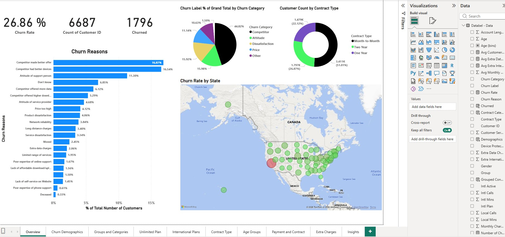
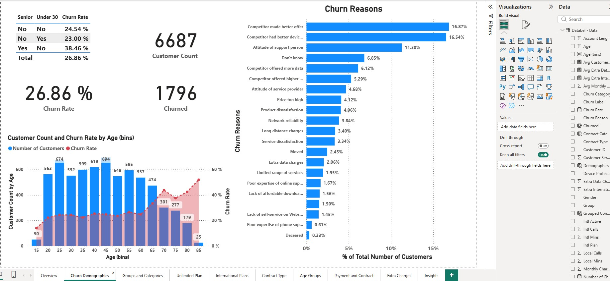
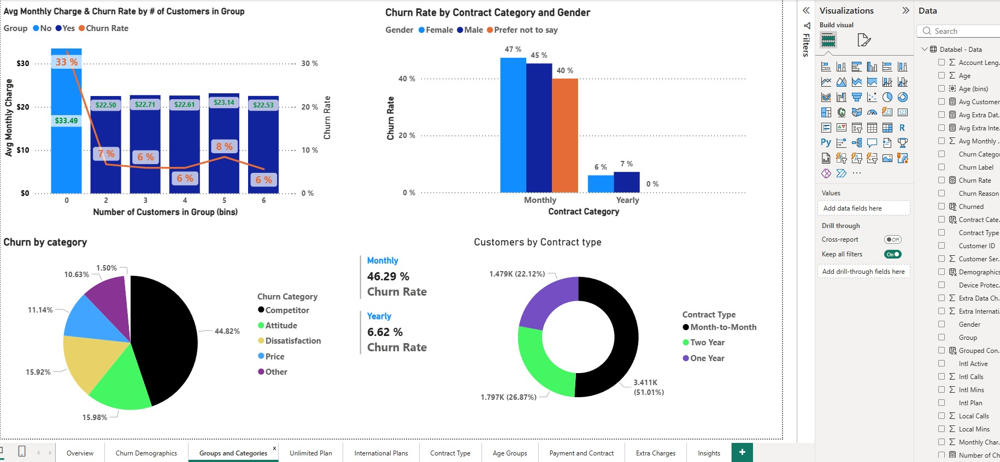
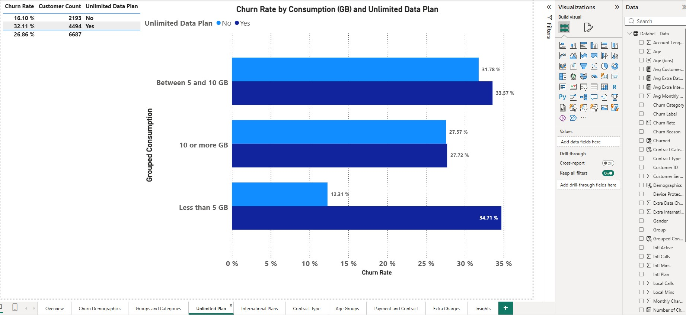
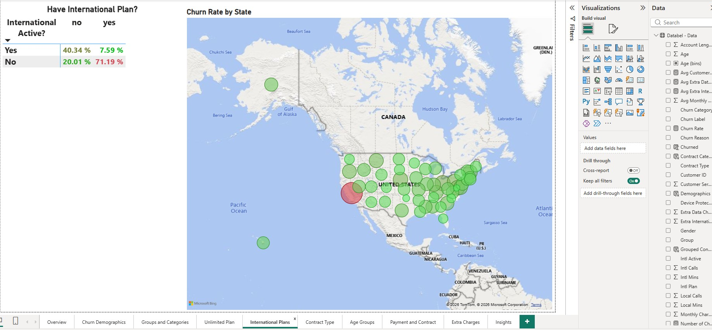
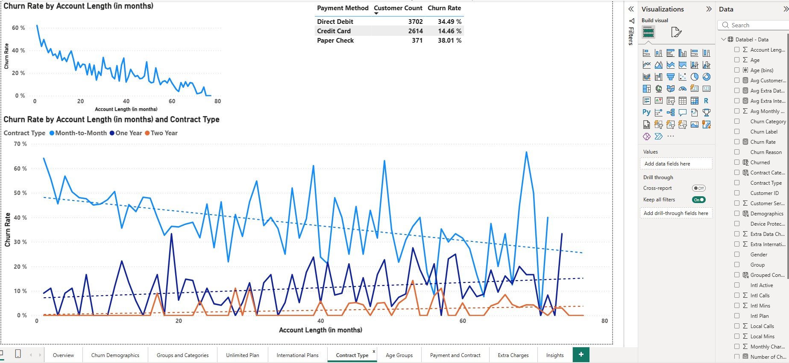
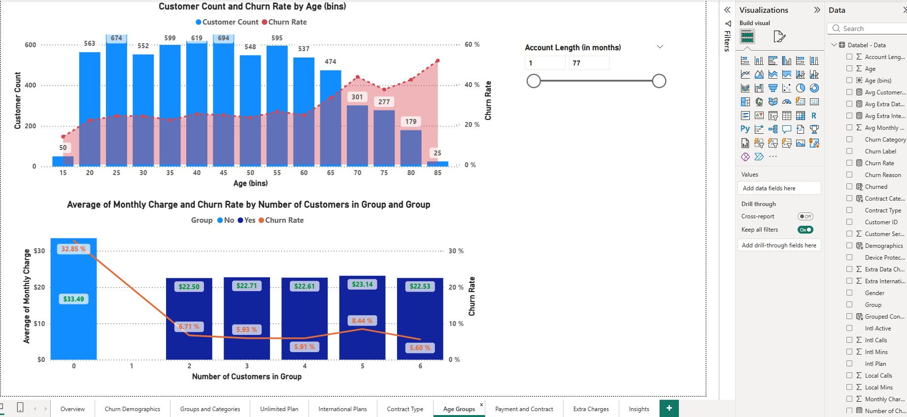
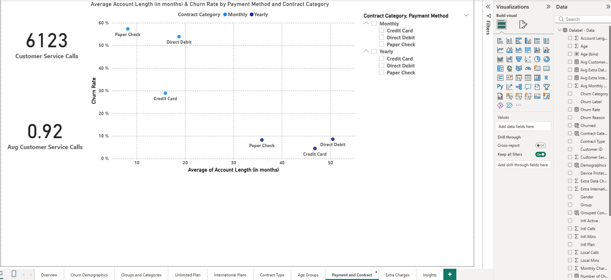
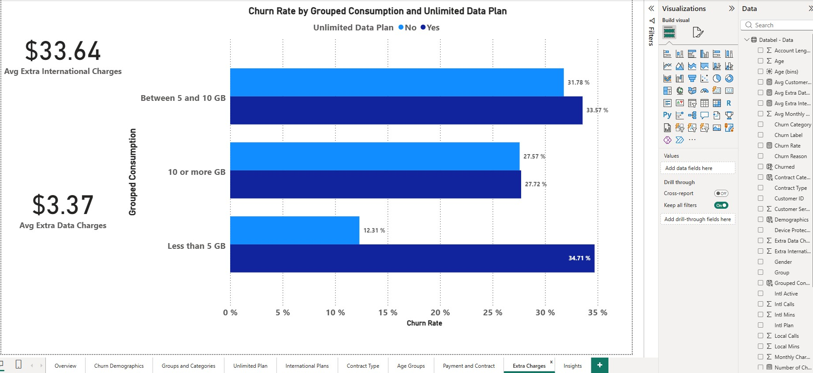
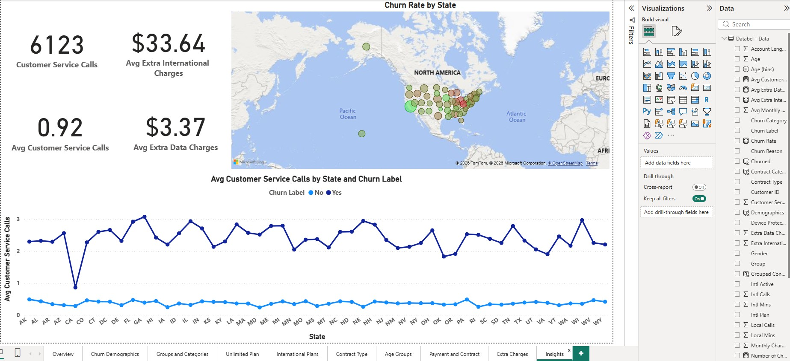

# Phone Company Churn Analysis

## Project Overview
Executives are concerned about customer churn. The following analyses provide insights as to which customers leave for a competitor.

## Dashboard Preview

## Key Insights
- **Insight 1: The top 2 reasons for customers leaving are: A competitor made a better offer and a competitor provided better devices.
- **Insight 2: The trend is, the older the customer, the greater tendency to leave for a competitor.
- **Insight 3: 71% of Customers who purchased an international plan but were not making international calls left for a competitor.
- **Insight 4: While month-to-month customers had the highest churn rate, the longer they stayed, the churn rate decreased.

## How to View
1. Download the `Churn_Analysis.pbix` file located in the Data_File folder
2. Open with [Power BI Desktop](https://www.microsoft.com/en-us/download/details.aspx?id=58494).